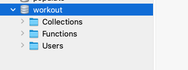

# Unit 17 Nosql Homework: Workout Tracker

For this assignment, you'll create a workout tracker. You have already been provided with the front end code in the `Develop` folder. This assignment will require you to create Mongo database with a Mongoose schema and handle routes with Express.

## User Story

* As a user, I want to be able to view create and track daily workouts. I want to be able to log multiple exercises in a workout on a given day. I should also be able to track the name, type, weight, sets, reps, and duration of exercise. If the exercise is a cardio exercise, I should be able to track my distance traveled.

## Business Context

A consumer will reach their fitness goals more quickly when they track their workout progress.

## Heroku Deployment

https://fathomless-caverns-02832.herokuapp.com/

Not able to populate Fitness tracker/ Dashboard. Funtionality works everywhere else. 

## Issues 

For whatever reason I am not getting any errors and I can't connect to db to the server.

## Screenshots

I have the database in 3T showing....